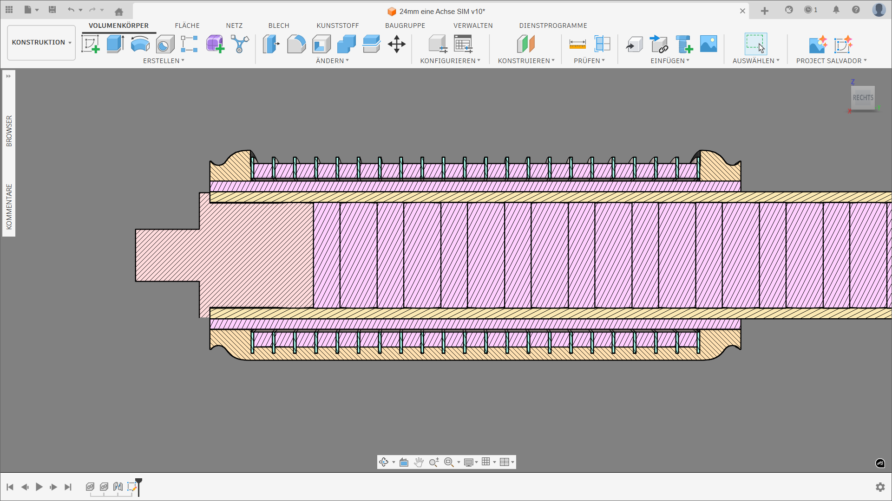
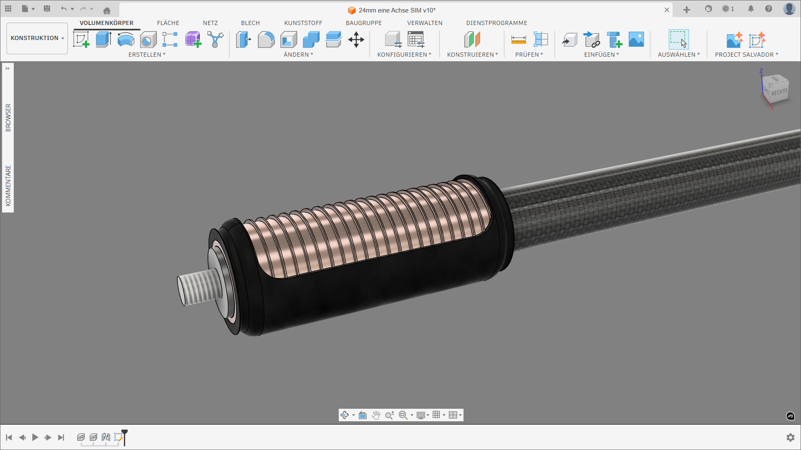
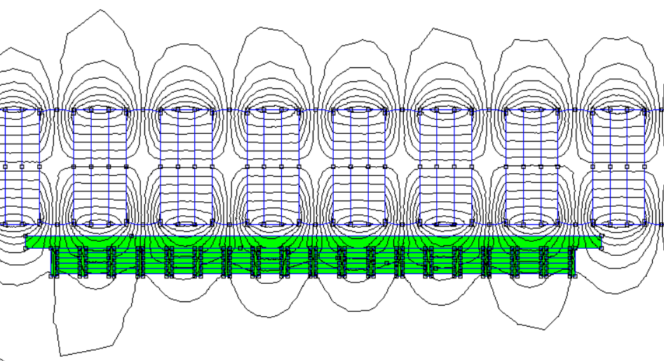
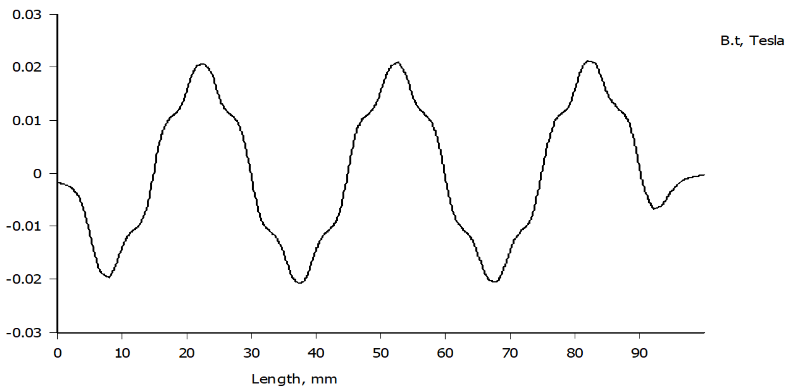
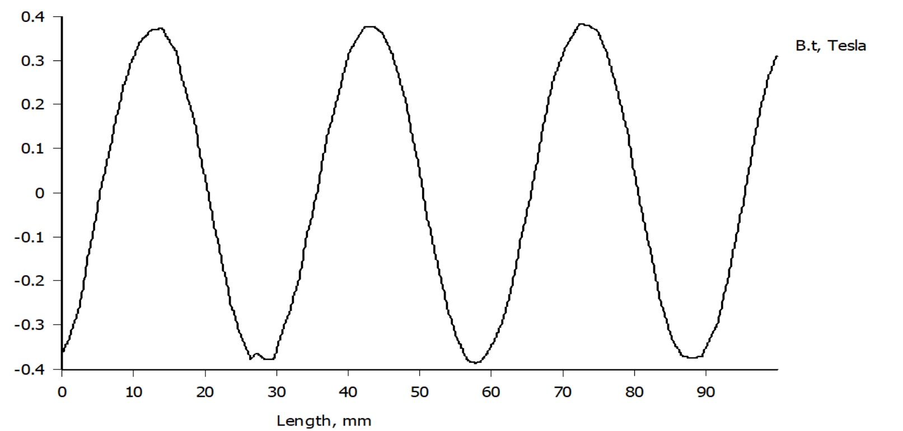

# Tubular Linear Motor

Open-source tubular linear motor with FOC control.

## CAD Design

Cross-sectional view showing the internal structure with stator magnets and coil arrangement:



3D render showing the complete mover assembly with copper windings and carbon fiber housing:



## Magnetic Field Simulations

FEMM simulation showing the magnetic field lines of the stator with permanent magnets:



Magnetic flux density (B-field) plot along the mover length, showing the sinusoidal field distribution:



## How It Works

Magnetic gearing principle: Two sine-wave fields interlock like gear teeth.

The stator's permanent magnets create a sinusoidal magnetic field pattern along its length. This "magnetic gear rack" provides the stationary field that the mover's traveling field engages with:



*The sinusoidal B-field (magnetic flux density) along the stator length. Each period corresponds to one pole pair (N-S), creating the "teeth" of the magnetic gear.*

- **Stator**: Permanent magnets create outward sine-wave field
- **Mover**: 3-phase coils create traveling inward field  
- **Result**: Fields mesh, producing linear force

## Specs

### General Parameters

| Parameter | Value |
|-----------|-------|
| Diameter | 24 mm |
| Pole Pitch | 30 mm (N-to-N) |
| Circumference | 81.68 mm |
| Phases | 3, star-connected |
| Control | FOC |

### Mover (Test Setup)

| Parameter | Value |
|-----------|-------|
| Magnet Diameter | 18 mm |
| Coil Diameter | 25 mm - 35 mm |
| Coil Configuration | 15 × 5 mm segments |
| Total Coil Length | 90 mm |
| **Simulated Force** | **60 N at 2 A** |

> **Note:** With higher financial effort (better magnetic materials, optimized coil winding, enhanced cooling), the design can be pushed to achieve significantly higher forces.

## Documentation

| Document | Content |
|----------|---------|
| [docs/PRINCIPLE.md](docs/PRINCIPLE.md) | Physics explanation |
| [docs/WINDING_CONFIG.md](docs/WINDING_CONFIG.md) | 3-phase winding theory |
| [docs/DESIGN_PRINCIPLES.md](docs/DESIGN_PRINCIPLES.md) | Design parameters |
| [docs/BUILDING.md](docs/BUILDING.md) | Construction guide |

## Repository

```
├── docs/               # Documentation
├── cad/                # CAD files (.step, .f3z)
├── simulations/        # FEMM files
├── data/               # Force profiles (Excel + CSV)
└── images/             # 3D renders
```

## Key Files

- `data/260331 Coil Config and Force Profile.xlsx` — Winding config & force calculations
- `cad/24mm eine Achse SIM.step` — CAD geometry
- `simulations/config1_20mm.FEM` — FEMM project

## License

See [LICENSE](LICENSE).

---

*Pole pitch 30mm, 24mm diameter, 3-phase FOC control.*
