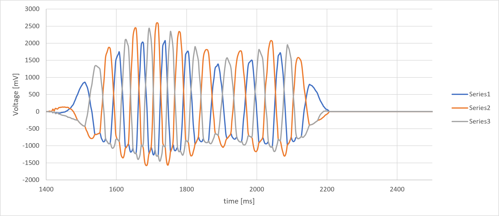

# Tubular Linear Motor

Open-source tubular linear motor with FOC control. **Parametric design** — scalable dimensions with invariant ratios.

## Design Overview

This project provides a **general parametric design** for tubular linear motors that can be scaled to different sizes while maintaining proper field geometry. The repository also documents a **specific test setup** being built for initial verification.

### Test Setup (Being Verified)

The simulations and CAD files in this repository represent a specific test configuration:

| Parameter | Value |
|-----------|-------|
| Outer Diameter | 24 mm |
| Pole Pitch (λ) | 30 mm |
| Coil Width | 5 mm (λ/6) |
| Mover Length | 90 mm (3× λ) |
| Simulated Force | 60 N at 2 A |

See [docs/DESIGN_PRINCIPLES.md](docs/DESIGN_PRINCIPLES.md) for complete scaling guidelines and how to choose electrical parameters (resistance, inductance) based on driver capabilities and force requirements.

## CAD Design

Cross-sectional view showing the internal structure with stator magnets and coil arrangement:


3D render showing the complete mover assembly with copper windings and carbon fiber housing:


## Magnetic Field Simulations

The motor operates on a magnetic gearing principle where two sine-wave fields interlock like gear teeth. FEMM simulations visualize this interaction: field lines show the flux paths from the stator magnets, while the B-field plots demonstrate the sinusoidal pattern that creates the "magnetic gear rack" the mover engages with.


*Magnetic field lines from the stator permanent magnets*


*Flux density along the mover length*


*Sinusoidal B-field along the stator — each period corresponds to one pole pair (N-S), forming the "teeth" of the magnetic gear*

### Parametric Design Principles

The motor follows these invariant relationships:

| Ratio | Value | Description |
|-------|-------|-------------|
| Coil width / Pole pitch | 1/6 | 6 coils per pole pitch (AbCaBc) |
| Spacer width / Magnet width | 0.9–1.2 | Flux shaping optimization |
| Edge rounding | ~5 × disk diameter | Sinusoidal field formation |

**General Formula:**
```
Mover: AbCaBc repeated X times
Width of one AbCaBc block = Pole pitch (λ)
Total mover length = X × λ
```

## Update July 2026:

Back EMF was measured, moving the coils over the stator arrangement fast gives this voltage response:



The voltage lines show a threephase response, exactly what you expect. Reversely, applying a sinusoidal three phase current on the motor will create a force and movement.

## Motor design via Excel and FEMM

The "magnetical gear" configuration was designed by using FEMM and Excel.
For a deep dive look into .

THe goal was to create a motor that also uses the current flowing back from the starpoint. 
(eg. Phase A is energized with 2A, Phase B and Phase C = -1A).

## Documentation

| Document | Content |
|----------|---------|
| [docs/PRINCIPLE.md](docs/PRINCIPLE.md) | Physics explanation |
| [docs/WINDING_CONFIG.md](docs/WINDING_CONFIG.md) | 3-phase winding theory |
| [docs/DESIGN_PRINCIPLES.md](docs/DESIGN_PRINCIPLES.md) | **Parametric design & test setup specs** |
| [docs/BUILDING.md](docs/BUILDING.md) | Construction guide |

## Repository

```
├── docs/               # Documentation
├── cad/                # CAD files (.step, .f3z)
├── simulations/        # FEMM + Python simulations
├── data/               # Force profiles (Excel + CSV)
└── images/             # 3D renders & plots
```

## Verification Plan

| Step | Method | Status |
|------|--------|--------|
| 1. FEMM simulation | Static field + force | ✓ Complete |
| 2. Python dynamics | MMK traveling wave | ✓ Complete |
| 3. Static force test | Measure F vs I | Pending |
| 4. Dynamic test | FOC velocity control | Pending |
| 5. Performance | Efficiency, thermal | Pending |

## License

See [LICENSE](LICENSE).

---

*Parametric tubular linear motor. Pole pitch λ = 30mm, 24mm diameter, 3-phase FOC.*
