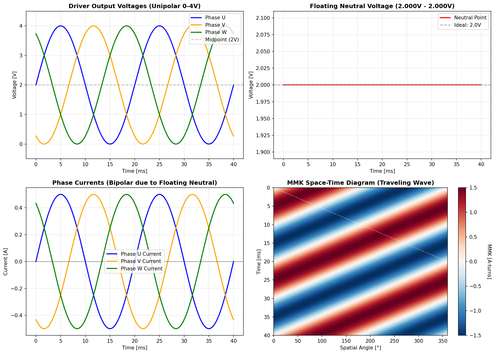
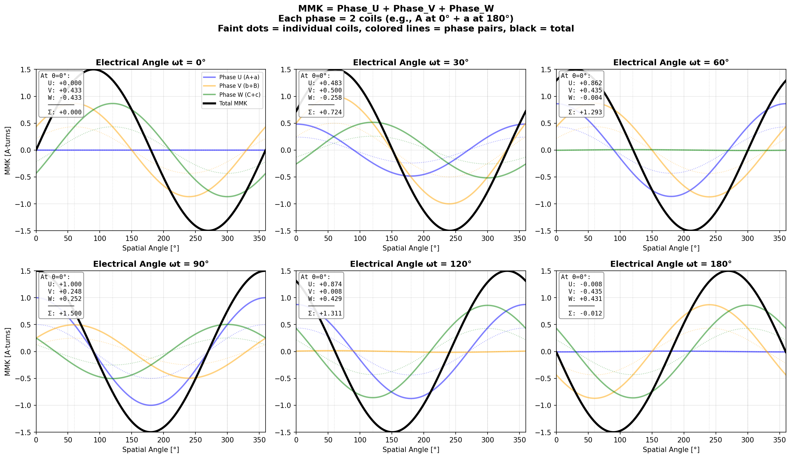

# Principle of Operation

## Magnetic Gearing

Two sine-wave magnetic fields interlock like gear teeth to produce linear force without contact.

**Stator (inside tube):**
- Alternating N-S magnets with steel disks
- Rounded ferromagnetic discs shape the field into a sine wave
- Creates outward sine-wave field (static)

**Mover (surrounds stator):**
- 3-phase coils in ferromagnetic slots
- Creates traveling sine-wave field (inward)

**Force:** Fields mesh like gear teeth. When mover field travels (driven by 3-phase currents), it pulls the mover along.

```
Stator:  ~~~ ~~~ ~~~ ~~~  (static outward)
             ↕ ↕ ↕ ↕
Mover:   ~~~ ~~~ ~~~ ~~~  (traveling inward)
             ↑ ↑ ↑ ↑
           Force
```

**Key:** Coil width = Pole pitch / 6 = 5 mm (for 30 mm pole pitch)

---

## Specifications

### General Parameters

| Parameter | Value |
|-----------|-------|
| Diameter | 24 mm |
| Pole Pitch (N-to-N) | 30 mm |
| Pole Width (N-to-S) | 15 mm |
| Circumference | 81.68 mm (from FEMM) |
| Phases | 3, star-connected |
| Control | FOC |

### Mover (Test Setup)

| Parameter | Value |
|-----------|-------|
| Magnet Diameter | 18 mm |
| Coil Diameter | 25 mm - 35 mm |
| Coil Configuration | 15 × 5 mm segments |
| Total Coil Length | 90 mm |
| **Simulated Force** | **60 N at 2 A** |

> **Note:** With higher financial effort (better magnetic materials, optimized coil winding, enhanced cooling), the design can be pushed to achieve significantly higher forces.

---

## Field Profile

FEMM simulations show the magnetic field distribution throughout the motor: field lines visualize the flux paths from the stator magnets, while the B-field plots demonstrate the sinusoidal pattern that creates the "magnetic gear rack" the mover engages with.


*Magnetic field lines from the stator permanent magnets*


*Flux density along the mover length*


*Sinusoidal B-field along the stator — each period corresponds to one pole pair (N-S), forming the "teeth" of the magnetic gear*

**Simulation Results:**
- Peak B-field: ~0.02 T
- Period: 30 mm (pole pitch)
- Clean sine wave confirms field shaping works

## Star-Connected BLDC Driver Simulation

The motor uses a star-connected 3-phase winding configuration (AbCaBc) with SimpleFOC control. A Python simulation demonstrates the key physics of how unipolar 0-4V PWM outputs create the bipolar currents necessary for rotating magnetic fields.


*Top-left: Unipolar 0-4V driver outputs (sinusoidal PWM with 2V DC offset). Top-right: Floating neutral point voltage (constant 2.0V with balanced resistances). Bottom-left: Resulting bipolar phase currents (±0.5A). Bottom-right: Space-time diagram showing the traveling MMK wave — the diagonal white line indicates wave propagation direction.*

### Key Physics

**Floating Neutral Point:**
In a star-connected motor with isolated neutral, the neutral voltage "floats" to a weighted average of the phase voltages. With equal phase resistances:
```
V_neutral = (V_U + V_V + V_W) / 3 = 2.0V (constant)
```

**Bipolar Current Generation:**
Even with unipolar 0-4V driver outputs, the effective voltage across each phase winding becomes bipolar:
```
I_phase = (V_driver - V_neutral) / R_phase
```
This yields ±2V effective voltage, producing ±0.5A currents with 4Ω phase resistance.


*Spatial MMK distribution showing how the total magnetic field (thick black line) is formed by summing three phase contributions (colored lines). Each phase consists of two coils in the AbCaBc pattern: Phase U = A(0°) + a(180°), Phase V = b(60°) + B(240°), Phase W = C(120°) + c(300°). The text boxes verify the sum at θ=0°: Total MMK = Phase_U + Phase_V + Phase_W. Faint dotted lines show the individual coil contributions.*

### AbCaBc Winding Configuration

The simulation models the AbCaBc winding pattern:
- **Phase U**: Coils A (0°) and a (180°) carry current i_U
- **Phase V**: Coils b (60°) and B (240°) carry current i_V  
- **Phase W**: Coils C (120°) and c (300°) carry current i_W

Winding directions alternate: A(+), b(-), C(+), a(-), B(+), c(-), creating the traveling magnetic field that pulls the mover along the stator.

---

*For construction details, see BUILDING.md. For winding configuration, see WINDING_CONFIG.md.*
