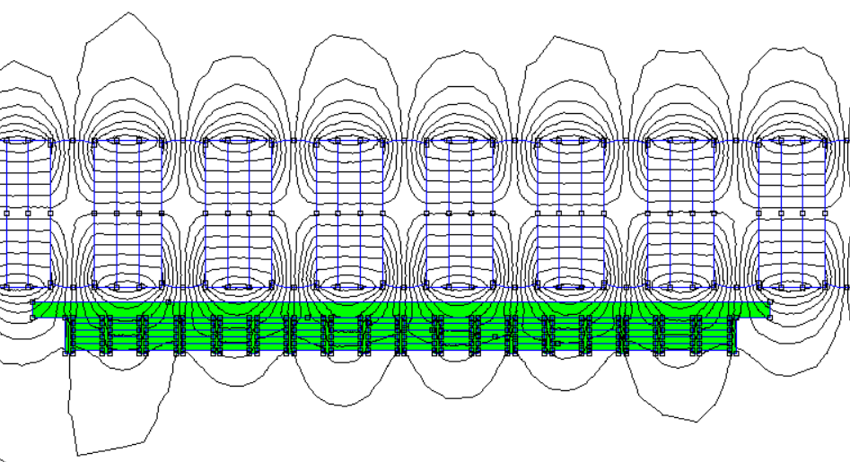
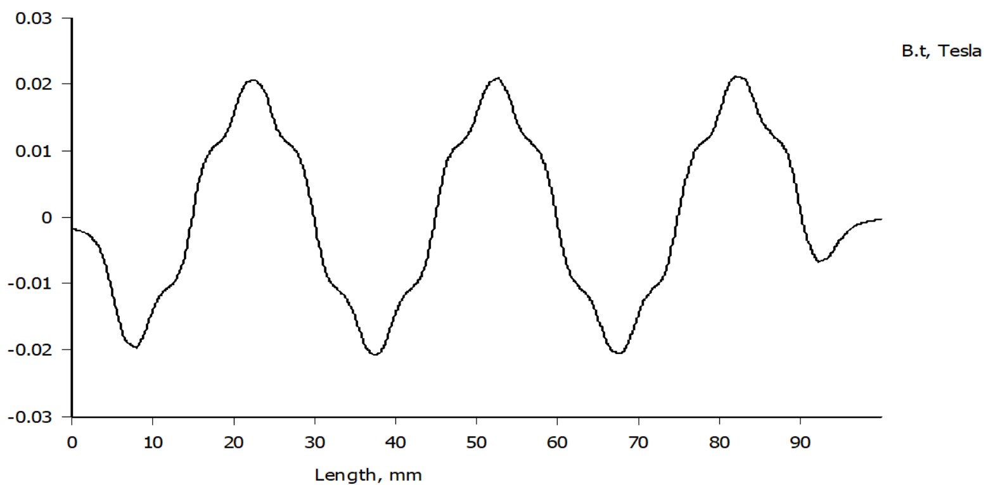
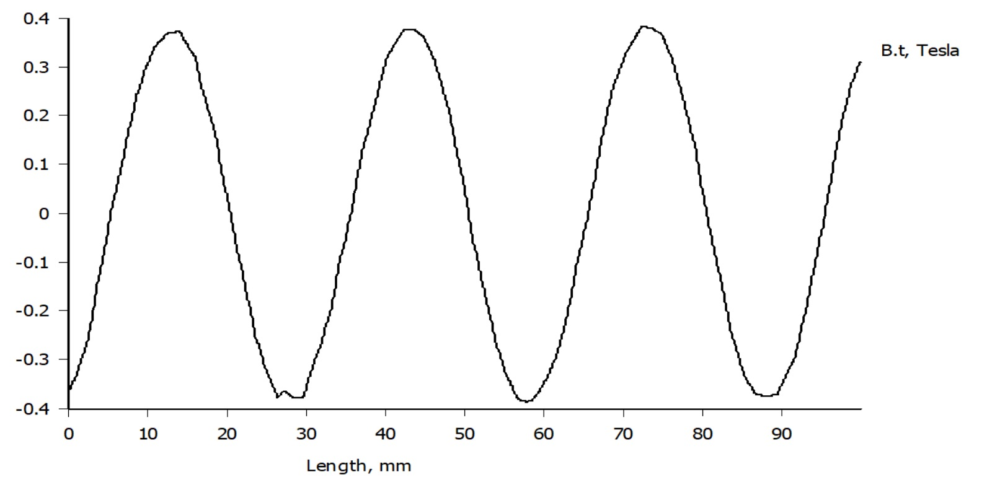
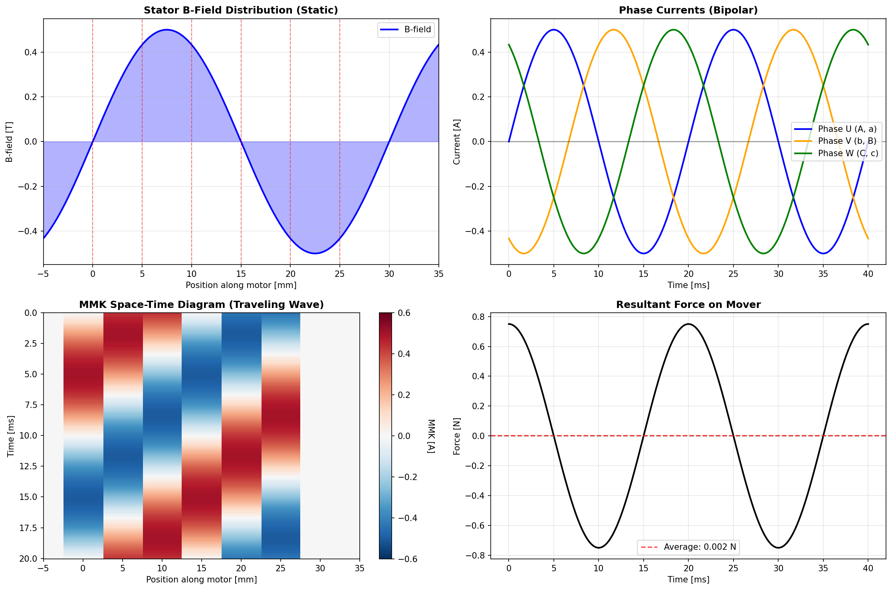
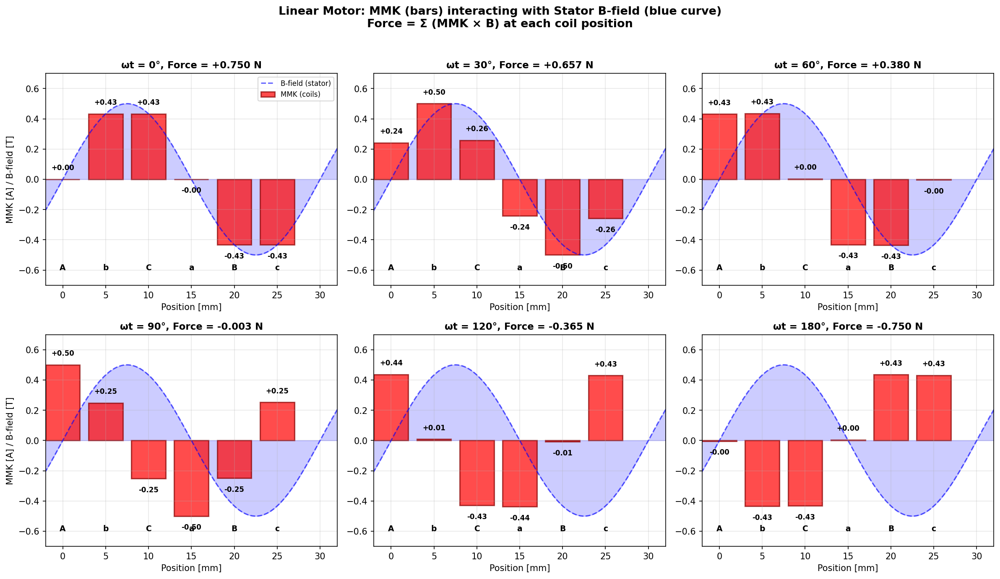

# Principle of Operation

## Magnetic Gearing

Two sine-wave magnetic fields interlock like gear teeth to produce linear force without contact.

**Stator (inside tube):**
- Alternating N-S magnets with steel disks
- Rounded ferromagnetic discs shape the field into a sine wave
- Creates outward sine-wave field (static)

**Mover (surrounds stator):**
- 3-phase coils in ferromagnetic slots
- Creates traveling sine-wave field (inward)

**Force:** Fields mesh like gear teeth. When mover field travels (driven by 3-phase currents), it pulls the mover along.

```
Stator:  ~~~ ~~~ ~~~ ~~~  (static outward)
             ↕ ↕ ↕ ↕
Mover:   ~~~ ~~~ ~~~ ~~~  (traveling inward)
             ↑ ↑ ↑ ↑
           Force
```

**Key:** Coil width = Pole pitch / 6 = 5 mm (for 30 mm pole pitch)

---

## Specifications

### General Parameters

| Parameter | Value |
|-----------|-------|
| Diameter | 24 mm |
| Pole Pitch (N-to-N) | 30 mm |
| Pole Width (N-to-S) | 15 mm |
| Circumference | 81.68 mm (from FEMM) |
| Phases | 3, star-connected |
| Control | FOC |

### Mover (Test Setup)

| Parameter | Value |
|-----------|-------|
| Magnet Diameter | 18 mm |
| Coil Diameter | 25 mm - 35 mm |
| Coil Configuration | 15 × 5 mm segments |
| Total Coil Length | 90 mm |
| **Simulated Force** | **60 N at 2 A** |

> **Note:** With higher financial effort (better magnetic materials, optimized coil winding, enhanced cooling), the design can be pushed to achieve significantly higher forces.

---

## Field Profile

FEMM simulations show the magnetic field distribution throughout the motor: field lines visualize the flux paths from the stator magnets, while the B-field plots demonstrate the sinusoidal pattern that creates the "magnetic gear rack" the mover engages with.


*Magnetic field lines from the stator permanent magnets*


*Flux density along the mover length*


*Sinusoidal B-field along the stator — each period corresponds to one pole pair (N-S), forming the "teeth" of the magnetic gear*

**Simulation Results:**
- Peak B-field: ~0.02 T
- Period: 30 mm (pole pitch)
- Clean sine wave confirms field shaping works

## Star-Connected BLDC Driver Simulation

The motor uses a star-connected 3-phase winding configuration (AbCaBc) with SimpleFOC control. The simulation below models the **test setup** configuration: coils distributed **along the motor length**, each interacting with the **local stator B-field** at its position.

**Note:** This simulation uses the specific test setup parameters (30mm pole pitch, 6 coils spanning one pole pitch). The general parametric design allows scaling these dimensions — see [DESIGN_PRINCIPLES.md](DESIGN_PRINCIPLES.md) for scaling guidelines.

### Test Setup Coil Layout

```
Position:   0mm    5mm    10mm   15mm   20mm   25mm   30mm (pole pitch)
            [A]    [b]    [C]    [a]    [B]    [c]
            │      │      │      │      │      │
Phase:      U      V      W      U      V      W
Direction:  +      -      +      -      +      -
```

The 6 coils are physically separated along the mover, spanning one pole pitch (30 mm). Each coil produces MMK (magnetomotive force) that interacts with the **local** sinusoidal B-field from the stator magnets.

### Simulation Results


*Top-left: Static sinusoidal B-field from stator magnets (period = 30 mm pole pitch). Top-right: Bipolar phase currents (±0.5A). Bottom-left: Space-time diagram showing the traveling MMK wave moving along the motor length. Bottom-right: Resultant force on mover (oscillates because at standstill, the relative alignment changes with electrical angle).*


*MMK distribution (red bars) interacting with stator B-field (blue curve) at different electrical angles. Each coil's MMK multiplies by the local B-field to produce force. The sum across all 6 coils gives total force (shown in titles). At ωt=0°, force is maximum (+0.750 N); at ωt=90°, force crosses zero; at ωt=180°, force reverses (-0.750 N).*

### Key Physics

**Force Calculation:**
Unlike a rotating motor where all coils are at the same radius, in a linear motor:
```
F_total = Σ (MMK_coil_i × B_stator(x_coil_i)) for i = 1 to 6
```

Each coil sees a different B-field depending on its position along the stator. The traveling MMK wave (created by time-varying 3-phase currents) "locks" into the static sinusoidal B-field and pulls the mover along.

**Floating Neutral Point:**
Same as before — the star connection with isolated neutral creates bipolar currents from unipolar 0-4V PWM:
```
I_phase = (V_driver - V_neutral) / R_phase = ±0.5 A
```

**With FOC Control:**
The force oscillates in the snapshots because the mover is at a fixed position. In operation, FOC controls the phase currents to maintain the MMK wave at a constant offset (typically 90° electrical) from the stator field, producing continuous force in one direction.

### Python Simulation

See [`simulations/linear_motor_correct_physics.py`](../simulations/linear_motor_correct_physics.py) for the full simulation code.

---

*For construction details, see BUILDING.md. For winding configuration, see WINDING_CONFIG.md.*
